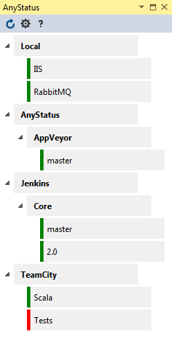
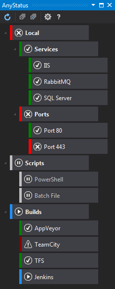

# AnyStatus

Download this extension from the [VS Gallery](https://visualstudiogallery.msdn.microsoft.com/d2262fef-aeca-45dd-9c8c-87c290ee4eb0)
or get the [CI build](http://vsixgallery.com/#/extension/AnyStatus.VSPackage.6f25620d-ff50-42d1-89da-709a45cebe10/).

---------------------------------------

AnyStatus is a free and open source Visual Studio Extension that adds basic monitoring capabilities to Visual Studio for resources and applications you run on your development and other environments. AnyStatus can monitor Builds (Jenkins, TeamCity & AppVeyor), Ping, TCP and HTTP response status code. More status and health checks will be added in future versions. AnyStatus runs in the background and does not have a significant impact on the performance or startup of Visual Studio.

See the [changelog](CHANGELOG.md) for changes and roadmap.

**Note:** This is an alpha version that comes with an incomplete set of basic features and has some known issues. I will be constantly working on AnyStatus to make sure every bug is fixed and all designed features are implemented.

## Features 

- Organize health checks in folders
- Colored status indicators
- Monitor Jenkins, TeamCity and AppVeyor builds
- Monitor HTTP response status codes
- Monitor Ping requests
- Monitor TCP ports

If you're interested in other types of status or health checks, please create a new issue on [GitHub](https://github.com/AlonAm/AnyStatus/issues).

### Theme Support

## Contribute

Check out the [contribution guidelines](CONTRIBUTING.md)
if you want to contribute to this project.

For cloning and building this project yourself, make sure
to install the
[Extensibility Tools 2015](https://visualstudiogallery.msdn.microsoft.com/ab39a092-1343-46e2-b0f1-6a3f91155aa6)
extension for Visual Studio which enables some features
used by this project.

## License

[Apache 2.0](https://github.com/AlonAm/AnyStatus/blob/master/LICENSE)

