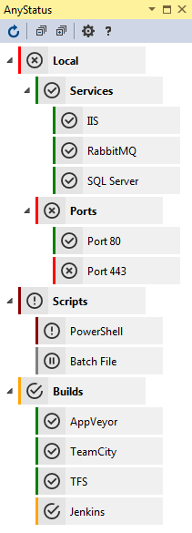

# AnyStatus Visual Studio Extension

Download this extension from the [VS Gallery](https://visualstudiogallery.msdn.microsoft.com/d2262fef-aeca-45dd-9c8c-87c290ee4eb0)
or get the [CI build](http://vsixgallery.com/#/extension/AnyStatus.VSPackage.6f25620d-ff50-42d1-89da-709a45cebe10/).

---------------------------------------

**AnyStatus** is a free and open source Visual Studio Extension that adds basic monitoring capabilities to Visual Studio for resources and applications you run on your development or other environments. AnyStatus runs in the background and does not have a significant impact on the performance or startup of Visual Studio.

See the [changelog](CHANGELOG.md) for changes and roadmap.

## Features 

- Organize items in folders
- Colored status indicators
- Monitors
  - Basic
    - HTTP
    - Ping
    - TCP/IP
    - Windows Service
  - Script
    - Batch File
    - PowerShell
  - Continuous Integration
    - Team Foundation Server
    - Team Foundation Services (Visual Studio Online)
    - Jenkins
    - TeamCity
    - AppVeyor

If you're interested in other types of status or health checks, please create a new issue on [GitHub](https://github.com/AlonAm/AnyStatus/issues).

### Screenshots

## Contribute

Check out the [contribution guidelines](CONTRIBUTING.md)
if you want to contribute to this project.

For cloning and building this project yourself, make sure
to install the
[Extensibility Tools 2015](https://visualstudiogallery.msdn.microsoft.com/ab39a092-1343-46e2-b0f1-6a3f91155aa6)
extension for Visual Studio which enables some features
used by this project.

## License

[Apache 2.0](https://github.com/AlonAm/AnyStatus/blob/master/LICENSE)

