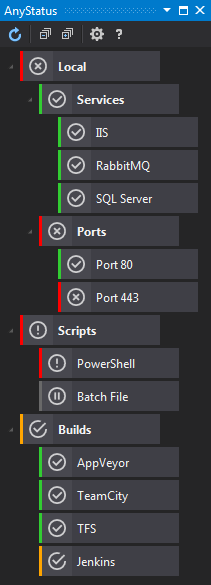

# AnyStatus Visual Studio Extension

Download this extension from the [Visual Studio Marketplace](https://marketplace.visualstudio.com/items?itemName=AlonAmsalem.AnyStatus)
or get the [CI build](http://vsixgallery.com/#/extension/AnyStatus.VSPackage.6f25620d-ff50-42d1-89da-709a45cebe10/).

---------------------------------------

**AnyStatus** is a free and open source Visual Studio extension that adds monitoring capabilities to Visual Studio to enable you monitor your development environment and other resources and applications on-premise or on the cloud. 

With AnyStatus you can monitor HTTP servers, send Ping requests, check TCP ports, monitor GitHub Issues, monitor builds on Team Foundation Server, Jenkins, TeamCity, AppVeyor and much more. All from within Visual Studio.

AnyStatus runs in the background and does not have a significant impact on the performance or startup of Visual Studio. Moreover, it loads only when the tool window is activated.

See the [changelog](https://github.com/AlonAm/AnyStatus/blob/master/CHANGELOG.md) for changes and roadmap.

# Features 

- Colored status indicators
- Organize monitors in folders
- Automatic and Manual status updates
- Enable or disable items
- Import and Export settings
- Informative log messages in output window

### Monitors

  - Basic
    - Ping
    - TCP/IP
    - HTTP
    - Windows Service
  - Scripts
    - Batch File
    - PowerShell Script
  - Continuous Integration
    - Team Foundation Server
    - Team Foundation Services (Visual Studio Online)
    - Jenkins
    - TeamCity
    - AppVeyor
  - Other
    - GitHub Issue

If you're interested in other types of status or health checks, please create a new issue on [GitHub](https://github.com/AlonAm/AnyStatus/issues).

See the [changelog](CHANGELOG.md) for changes and **roadmap**.

### Screenshots

## Contribute

Check out the [contribution guidelines](CONTRIBUTING.md)
if you want to contribute to this project.

For cloning and building this project yourself, make sure
to install the
[Extensibility Tools 2015](https://visualstudiogallery.msdn.microsoft.com/ab39a092-1343-46e2-b0f1-6a3f91155aa6)
extension for Visual Studio which enables some features
used by this project.

## License

[Apache 2.0](https://github.com/AlonAm/AnyStatus/blob/master/LICENSE)

